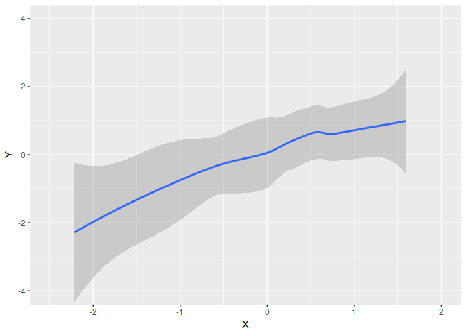

<!-- README.md is generated from README.Rmd. Please edit that file -->
ggbuildr
========

[](https://travis-ci.org/jongbinjung/ggbuildr) [](https://codecov.io/gh/jongbinjung/ggbuildr) [](http://cran.r-project.org/package=ggbuildr)

`ggbuildr` is a simple tool for saving incremental "builds" of a ggplot object. Intended use-case is to save plots for presentation slides.

Installation
------------

To install from CRAN:

``` r
install.packages("ggbuildr")
```

or to install cutting-edge development version from Github:

``` r
# Currently only available as development version from Github
# install.packages("devtools")
devtools::install_github("jongbinjung/ggbuildr")
```

Usage
-----

``` r
library(ggplot2)
library(ggbuildr)

set.seed(1)
X <- rnorm(20)
Y <- X + rnorm(20)

pd <- data.frame(X, Y)
p <- ggplot(pd, aes(X, Y)) +
  geom_smooth() +
  geom_point(shape = 21, size = 2,
             fill = "white", color = "black") +
  # Fixing the limits ensure plot ranges are constant
  coord_cartesian(xlim = c(-2.5, 2), ylim = c(-4, 4))

# Plot smooth, and then point
build_plot(p, build_order = list(1, 2))
```



``` r

# Plot point, and then smooth, but preserve order (i.e, keep points on top)
build_plot(p, build_order = list(2, 1))
```


``` r

# Plot point, and then smooth, and draw smooth layer on top of point
build_plot(p, build_order = list(2, 1), preserve_order = FALSE)
```


